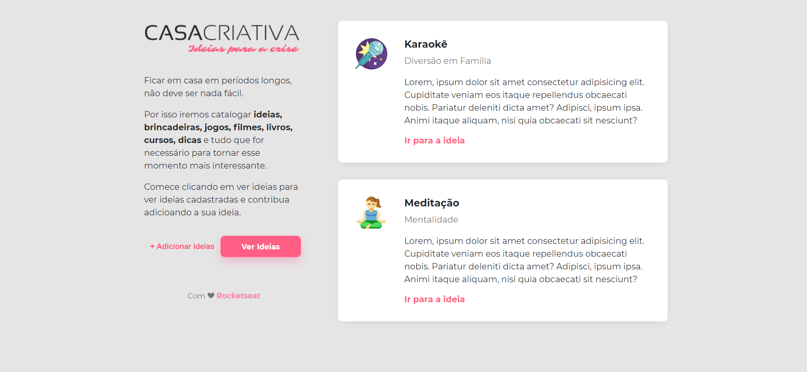
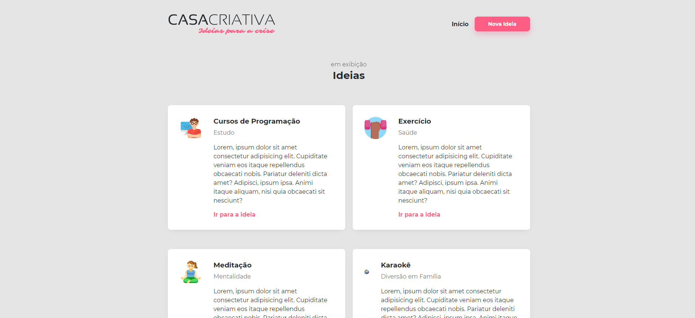
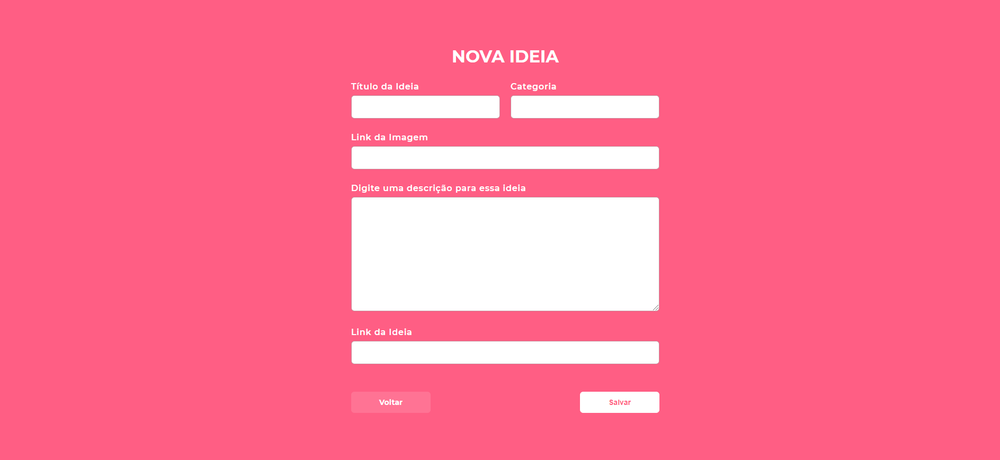

<h1>Casa Criativa (Projeto em Construção)</h1>

O projeto <strong>Casa Criativa</strong> foi desenvolvido durante o "WorkshopDev Especial" da Rocketseat ministrado por Mayk Brito

## 💻 Front-end

## 🚀 Tecnologias utilizadas:

  - [HTML](https://www.w3schools.com/html/default.asp)
  - [CSS](https://www.w3schools.com/css/)
  - [JavaScript](https://www.w3schools.com/js/)
  - [Node.js](https://nodejs.org/en/)
  - [Express](https://www.npmjs.com/package/express)
  - [Nunjucks](https://www.npmjs.com/package/nunjucks)
  - [Nodemon](https://www.npmjs.com/package/nodemon)
  - [SQLite3](https://www.npmjs.com/package/sqlite3)

## 🔧 Projeto

#### Este projeto teve como objetivo criar um Web Site Utilizando HTML, CSS e JavaScript para armazenar sugestões criativas de atividades que podem ser realizadas durante a quarentena.

## :memo: Licença

#### Esse projeto está sob a licença [MIT](./LICENSE). Veja o arquivo [LICENSE](./LICENSE) para mais detalhes.

Feito com ❤️ Luciano Teles
